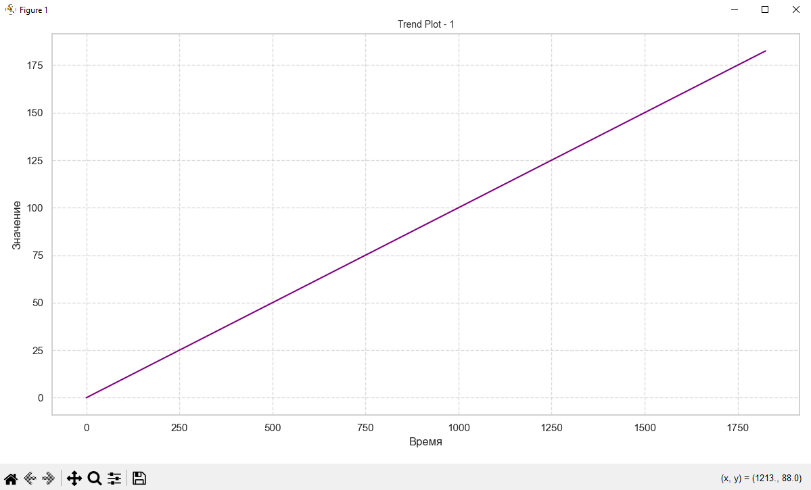
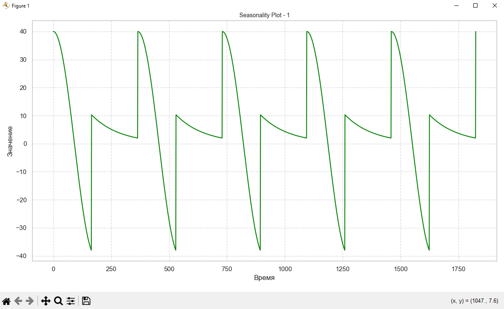
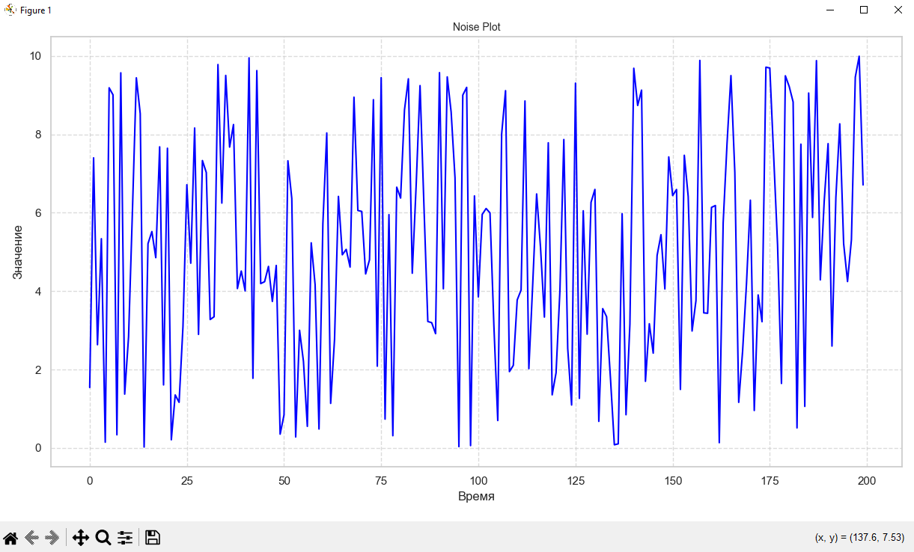
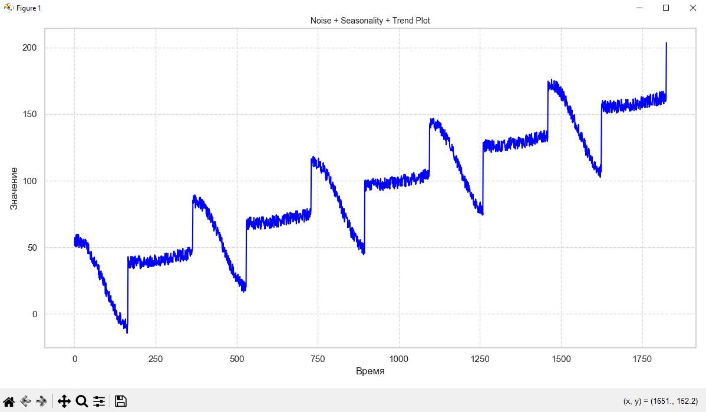

# Визуализация временных рядов с использованием Matplotlib, Seaborn и Plotly

Этот проект демонстрирует создание и визуализацию различных типов временных рядов, включая тренды, сезонность и шум. Для построения графиков используются библиотеки **Matplotlib**, **Seaborn** и **Plotly**, что позволяет создавать как статичные, так и интерактивные визуализации данных. Проект охватывает как базовые, так и более сложные концепции анализа временных рядов.

## Описание

В данном проекте:
- **Matplotlib** используется для создания стандартных статичных графиков.
- **Seaborn** улучшает визуализацию, предоставляя стильные и удобные графики.
- **Plotly** позволяет создавать интерактивные графики, которые можно масштабировать и исследовать в реальном времени.

Проект иллюстрирует, как можно комбинировать различные компоненты временных рядов, такие как тренды, сезонность и шум, для создания более сложных моделей данных.

## Требования

Перед запуском убедитесь, что у вас установлены следующие библиотеки:

- **`numpy`** — для работы с массивами данных.
- **`matplotlib`** — для создания статичных графиков.
- **`seaborn`** — для улучшения визуализации с помощью эстетичных графиков.
- **`plotly`** — для создания интерактивных графиков.

Для установки зависимостей, выполните команду:

```bash
pip install numpy matplotlib seaborn plotly
```

## Структура кода

### Импорт библиотек

```python
import numpy as np
import matplotlib.pyplot as plt
import seaborn as sns
import plotly.graph_objects as go
```

- **`numpy`** - используется для работы с числовыми данными.
- **`matplotlib.pyplot`** - отвечает за создание стандартных графиков.
- **`seaborn`** - используется для улучшения визуализации графиков.
- **`plotly.graph_objects`** - предоставляет возможность строить интерактивные графики.

### Создание тренда

Для создания линейного тренда используется функция **`trend`**:

```python
def trend(time, slope=0):
    return slope * time
```

- `slope` — параметр для наклона линии тренда, может быть как положительным, так и отрицательным.

Функция добавляет тренд к временной серии с заданным наклоном (положительным или отрицательным).

### Сезонность

Для моделирования сезонных колебаний используются функции **`seasonal_pattern`** и **`seasonality`**:

```python
def seasonal_pattern(season_time):
    return np.where(season_time < 0.45,
                   np.cos(season_time * 2 * np.pi),
                   1 / np.exp(3 * season_time))

def seasonality(time, period, amplitude=1, phase=0):
    season_time = ((time + phase) % period) / period
    return amplitude * seasonal_pattern(season_time)
```

- `period` — период сезонности.
- `amplitude` — амплитуда сезонности.
- `phase` — сдвиг фазы.

Эти функции генерируют сезонные колебания, которые можно использовать для моделирования циклических данных.

### Белый шум

Функция **`white_noise`** генерирует случайный белый шум:

```python
def white_noise(time, noise_level=1, seed=None):
    random = np.random.RandomState(seed)
    return random.random(len(time)) * noise_level
```

- `noise_level` — уровень шума, который влияет на амплитуду.

## Визуализация данных

Для каждого типа данных (тренд, сезонность, шум и т. д.) предусмотрены три варианта визуализации:

1. **Matplotlib** — стандартная визуализация.
2. **Seaborn** — стилезованные графики.
3. **Plotly** — интерактивные графики.

Пример функции для визуализации с помощью Seaborn:

```python
def plot_seaborn_series(time, series, start=0, end=None, color="blue"):
    sns.lineplot(x=time[start:end], y=series[start:end], color=color)
    plt.xlabel("Время")
    plt.ylabel("Значение")
    plt.tight_layout()
```
Аналогичная функция для **Plotly**:

```python
def plot_plotly_series(time, series, start=0, end=None, title="Plot", color="blue"):
    fig = go.Figure()
    fig.add_trace(go.Scatter(x=time[start:end], y=series[start:end], mode='lines', 
    line=dict(color=color)))
    fig.update_layout(title=title, xaxis_title="Время", yaxis_title="Значение")
    fig.show()
```

## Пример использования

### 1. Тренд
Пример создания тренда с положительным наклоном:

```python
slope = 0.1
series = trend(time, slope)
plot_series(time, series, color="purple")
plt.title("Trend Plot - 1")
plt.show()
```

Аналогичные графики строятся с помощью Seaborn и Plotly.

### 2. Сезонность:
Пример создания сезонности:

```python
series = seasonality(time, period=365, amplitude=40)
plot_series(time, series, color="green")
plt.title("Seasonality Plot - 1")
plt.show()
```

### 3. Белый шум:
Пример генерации белого шума:

```python
noise = white_noise(time, noise_level=10)
plot_series(time[:200], noise[:200], color="blue")
plt.title("Noise Plot")
plt.show()
```

### 4. Комбинированные графики
Пример создания комбинированного графика, который включает тренд и сезонность:

```python
series = trend(time, 0.08) + seasonality(time, period=365, amplitude=40)
plot_series(time, series, color="green")
plt.title("Seasonality + Trend Plot")
plt.show()
```

## Запуск кода
После того как все зависимости установлены, запустите скрипт:

```bash
python time_series_visualization.py
```

Код создаст несколько графиков для различных типов данных и сохранит их в виде изображений.

## Визуализация в Google Colab

Если вы хотите запустить код в Google Colab, просто загрузите файл **`.ipynb`** и выполните ячейки.

1. Перейдите на [Google Colab](https://colab.google/).
2. Загрузите файл `time_series_plot.ipynb` через меню "Файл" → "Открыть блокнот" → "Загрузить".
3. Запустите ячейки по порядку, чтобы увидеть графики.

## Скриншоты

### Пример 1: Тренд



### Пример 2: Сезонность



### Пример 3: Белый шум



### Пример 4: Комбинированный график



## Примечания

- Для корректного отображения интерактивных графиков **Plotly** требуется браузер или интеграция с **Google Colab**.
- Для лучшего отображения графиков в **Google Colab** используйте встроенную поддержку **Plotly**.
